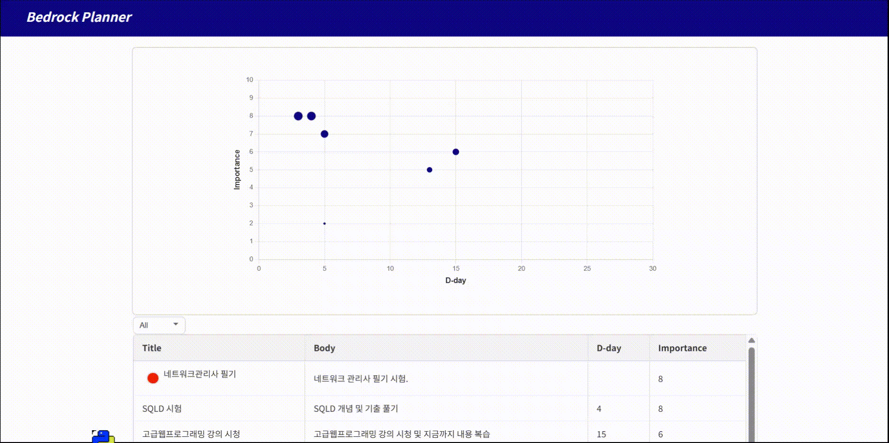
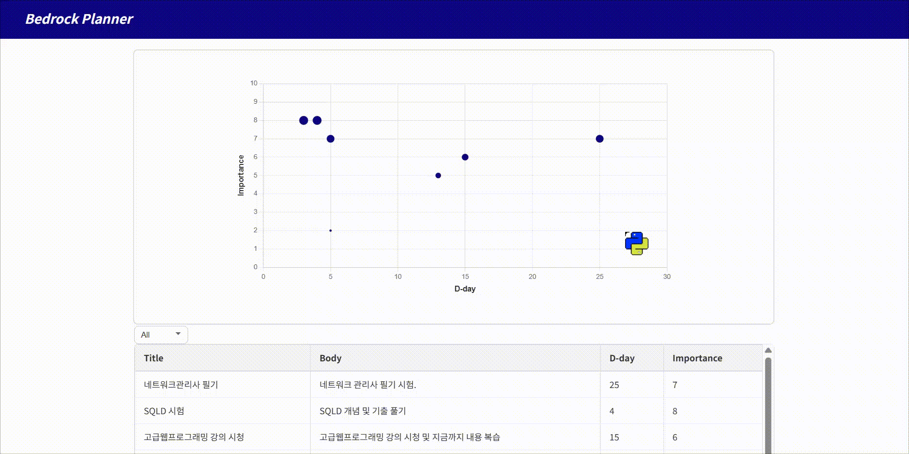

# Bedrock Planner

README 작성 중...

## 실행

> [!NOTE]
> 
> **실행 환경**
> 
> * [ ] make 실행 환경 (선택)
> 
> * [x] docker 실행 환경 (필수)

```bash
# make
make start

# docker만 있다면
docker compose up --build
```

## Table to Graph 드래그



공백이었던 D-day column 값이 채워진 것을 볼 수 있음


## Graph 안에서 드래그



1 행의 D-day 값이 수정되는 걸 볼 수 있음